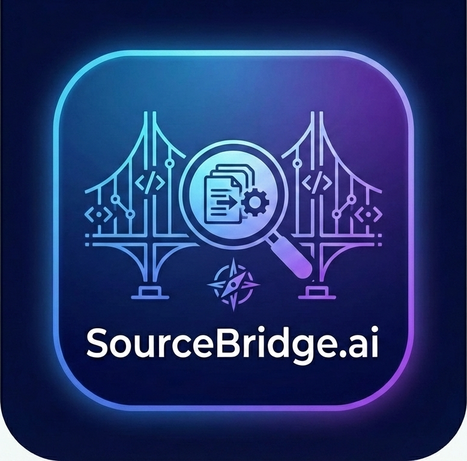
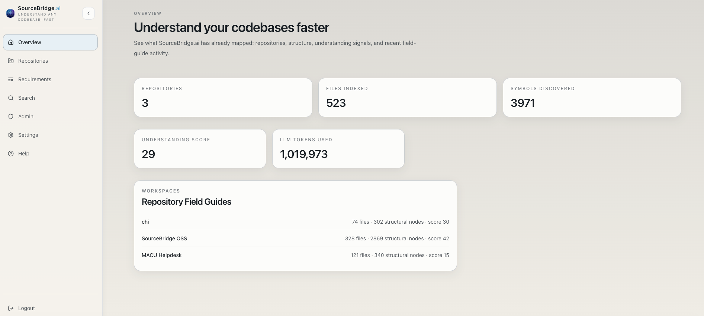
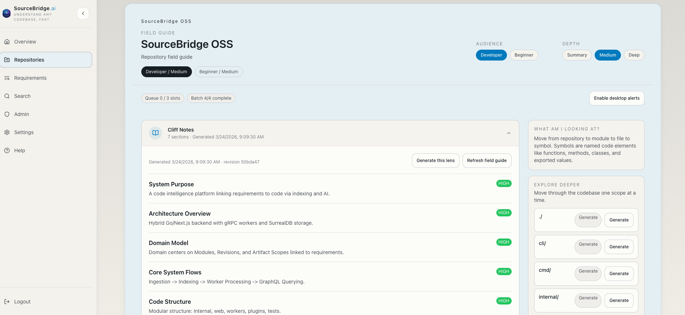
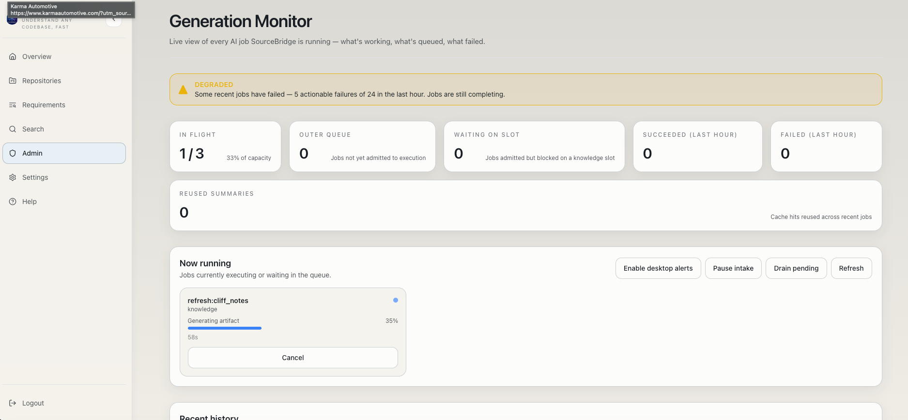
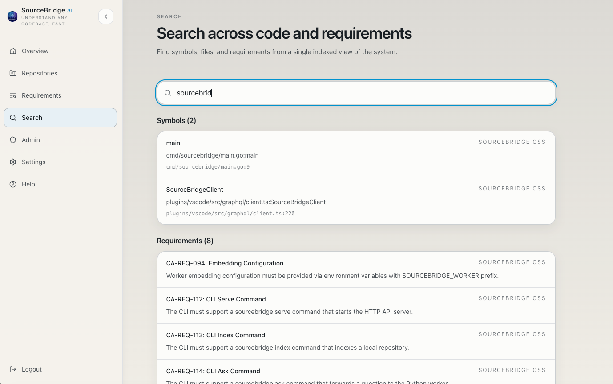

<p align="center">
  
</p>

<h1 align="center">SourceBridge.ai</h1>

<p align="center"><strong>The field guide your codebase should have had.</strong></p>

[](https://github.com/sourcebridge-ai/sourcebridge/actions/workflows/ci.yml)
[](LICENSE)
[](https://go.dev/)
[](https://github.com/sourcebridge-ai/sourcebridge/releases)
[](https://hub.docker.com/u/sourcebridge)

**New here? [GETTING-STARTED.md](GETTING-STARTED.md) — 5-minute setup, step by step.**

## What is SourceBridge?

SourceBridge is a requirement-aware code comprehension platform. Point it at any codebase and it generates field guides -- cliff notes, learning paths, code tours, architecture diagrams, and workflow stories -- so your team can understand how a system actually works. It also traces requirements to code, runs AI-powered reviews, and serves as an MCP server for AI agent integration.

Most tools help you search code. **SourceBridge helps you understand systems.**

<p align="center">
  
</p>

<details>
<summary><strong>More screenshots</strong></summary>

### Cliff Notes
<p align="center">
  
</p>

### Admin Monitor
<p align="center">
  
</p>

### Semantic Search
<p align="center">
  
</p>

</details>

## Key Features

- **Code Indexing** -- Tree-sitter based parsing for Go, Python, TypeScript, JavaScript, Java, Rust, and C++
- **Field Guides** -- Cliff notes, learning paths, code tours, workflow stories, and system explanations at repository, file, and symbol levels
- **Requirement Tracing** -- Import requirements from Markdown or CSV, auto-link to code, generate traceability matrices
- **Code Review** -- AI-powered structured reviews (security, SOLID, performance, reliability, maintainability)
- **Code Discussion** -- Conversational exploration with full codebase context
- **Architecture Diagrams** -- Auto-generated Mermaid diagrams from code structure
- **Impact Analysis** -- Simulate changes and see affected requirements and code paths
- **MCP Server** -- Model Context Protocol support for AI agent integration ([setup guide](docs/user/mcp-clients.md))
- **VS Code Extension** -- First-class editor integration: inline requirement lenses, streaming AI chat (`Cmd+I`), create/edit requirements from the sidebar, one-keystroke field guides ([install guide](plugins/vscode/README.md))
- **Multi-Provider LLM** -- Works with cloud APIs (Anthropic, OpenAI, Gemini, OpenRouter) or fully local inference (Ollama, vLLM, llama.cpp, SGLang, LM Studio)
- **GraphQL API** -- Full programmatic access to all platform capabilities
- **CLI** -- Complete command-line interface for scripting and automation

## Quick Start

See [GETTING-STARTED.md](GETTING-STARTED.md) for the complete 5-minute setup: secrets, LLM config, first repo, and first field guide.

For other install paths (Kubernetes, Helm, from source), see [docs/installation.md](docs/installation.md).

### Try the demo

SourceBridge includes a sample TypeScript project you can index immediately:

```bash
git clone https://github.com/sourcebridge-ai/sourcebridge.git
cd sourcebridge
./demo.sh
```

The demo starts SourceBridge, indexes a 44-file sample API, and generates cliff notes, code tours, and architecture diagrams. Open [http://localhost:3300](http://localhost:3300) to explore.

### CLI — one line, any platform

```bash
curl -fsSL https://<your-sourcebridge-server>/install.sh | sh -s -- --server https://<your-sourcebridge-server>
```

Installs to `~/.local/bin/sourcebridge` (no `sudo`), authenticates against
your server, and you're ready to run `sourcebridge setup claude` in any
indexed repository. See [Installation](docs/user/installation.md) for the
trust model, alternate paths (`brew install sourcebridge-ai/tap/sourcebridge`,
manual download, build from source), and upgrade/uninstall instructions.

### Server — Docker compose

```bash
git clone https://github.com/sourcebridge-ai/sourcebridge.git
cd sourcebridge
cp .env.example .env   # configure your LLM provider
docker compose up -d
```

### Helm / Kubernetes

For production deployments:

```bash
helm install sourcebridge deploy/helm/sourcebridge/ \
  --set llm.provider=anthropic \
  --set llm.apiKey=$ANTHROPIC_API_KEY
```

See [Helm Guide](docs/self-hosted/helm-guide.md) for full configuration options, including air-gapped and local inference setups.

### Kustomize (raw manifests)

Use an overlay to pin image tags, set your hostname, and configure `NEXT_PUBLIC_API_URL`:

```yaml
# my-overlay/kustomization.yaml
apiVersion: kustomize.config.k8s.io/v1beta1
kind: Kustomization

resources:
  - github.com/sourcebridge-ai/sourcebridge//deploy/kubernetes/base?ref=v0.15.1-rc.3

# Pin image tags (replace pin-via-overlay-do-not-use placeholder)
images:
  - name: ghcr.io/sourcebridge-ai/sourcebridge-api
    newTag: v0.15.1-rc.3
  - name: ghcr.io/sourcebridge-ai/sourcebridge-worker
    newTag: v0.15.1-rc.3
  - name: ghcr.io/sourcebridge-ai/sourcebridge-web
    newTag: v0.15.1-rc.3

patches:
  # Set the Ingress hostname and NEXT_PUBLIC_API_URL together.
  # NEXT_PUBLIC_API_URL is baked into the web image at build time — this
  # env override is for documentation/tooling; use the Ingress hostname
  # as the authoritative public URL.
  - target:
      kind: Ingress
      name: sourcebridge-ingress
    patch: |
      - op: replace
        path: /spec/rules/0/host
        value: sourcebridge.yourdomain.com
      - op: replace
        path: /spec/tls/0/hosts/0
        value: sourcebridge.yourdomain.com
  - target:
      kind: Deployment
      name: sourcebridge-web
    patch: |
      - op: replace
        path: /spec/template/spec/containers/0/env/0/value
        value: "https://sourcebridge.yourdomain.com"
```

```bash
kubectl apply -k my-overlay/
```

See [`deploy/kubernetes/base/README.md`](deploy/kubernetes/base/README.md) for the full operator guide (storage classes, secrets, mTLS).

## VS Code Extension

Use SourceBridge without leaving your editor. The extension is in [`plugins/vscode/`](plugins/vscode/) and talks to any SourceBridge server — local, Docker, Helm, or a shared team deployment.

<p align="center">
  <em>Inline requirement lenses · streaming AI chat · sidebar CRUD · one-keystroke field guides</em>
</p>

### Install

From a pre-built VSIX:

```bash
# Build the VSIX from source
make package-vscode

# Install it into your local VS Code
make install-vscode
```

Or from inside VS Code: `Cmd+Shift+P` → **Extensions: Install from VSIX…** → pick `plugins/vscode/sourcebridge-*.vsix`.

### Configure

1. `Cmd+Shift+P` → **SourceBridge: Sign In**
2. Enter your server URL (e.g. `http://localhost:8080` for local dev, or your team's deployed URL)
3. Pick sign-in method (browser OIDC or local password)

The status bar (bottom-left) reflects connection state: `connected · <repo>`, `offline · retry in Ns`, `sign in required`, etc. Click it for quick actions.

### Highlights

| Flow | How | What happens |
|---|---|---|
| **Ask streaming** | `Cmd+I` on any selection | Chat panel opens; tokens stream in live via MCP (fallback: non-streaming GraphQL if server doesn't mount MCP) |
| **Show linked requirements** | `Cmd+.` on a function | Lightbulb menu lists linked requirements; click to open detail panel |
| **Create requirement** | `Cmd+.` on an unlinked symbol → *Create requirement from this symbol…* | Inline flow pre-fills title from the symbol name; the new requirement is linked automatically |
| **Edit / delete from sidebar** | Hover a requirement row in the activity bar | Pencil + trash icons; delete soft-deletes (30-day recycle bin) |
| **Field guide for file** | `Cmd+K N` | Generates cliff notes for the active file and opens the panel |
| **Change Risk tree** | Activity bar → Change Risk | Shows changed files / affected requirements / stale field guides from the latest impact report |
| **Scoped palette** | `Cmd+Shift+;` | Context-filtered picker — only shows actions valid for your current focus |

Full feature list + troubleshooting in [`plugins/vscode/README.md`](plugins/vscode/README.md).

### Develop / contribute

```bash
cd plugins/vscode
npm install
npm run watch      # rebuilds on save
# Open the folder in VS Code, press F5 → "Run Extension" for a dev host
```

Tests: `make test-vscode` (or `npm test` from inside `plugins/vscode/`).

## Architecture

```
                    ┌──────────────────────────────────┐
                    │           Clients                │
                    │   Web UI / CLI / MCP / GraphQL   │
                    └──────────────┬───────────────────┘
                                   │
                    ┌──────────────▼───────────────────┐
                    │        Go API Server             │
                    │   chi router + gqlgen GraphQL    │
                    │   JWT auth, OIDC SSO, REST       │
                    │   tree-sitter code indexer        │
                    └───────┬──────────────┬───────────┘
                            │              │
               ┌────────────▼──┐    ┌──────▼──────────┐
               │   SurrealDB   │    │  Python Worker   │
               │   (embedded   │    │  gRPC service    │
               │   or external)│    │  AI reasoning,   │
               └───────────────┘    │  linking,        │
                                    │  requirements,   │
               ┌───────────────┐    │  knowledge,      │
               │  Redis Cache  │    │  contracts       │
               │  (optional,   │    └──────┬───────────┘
               │  defaults to  │           │
               │  in-memory)   │    ┌──────▼───────────┐
               └───────────────┘    │   LLM Provider   │
                                    │  Cloud or Local   │
                                    └──────────────────┘
```

**Go API Server** (`internal/`, `cmd/`) -- HTTP and GraphQL API, authentication, code indexing, and request routing. Handles tree-sitter parsing for 7 languages.

**Python gRPC Worker** (`workers/`) -- AI reasoning engine that communicates with LLM providers. Services include reasoning, linking, requirements analysis, knowledge extraction, and contract generation.

**Next.js Web UI** (`web/`) -- React 19, Tailwind CSS, CodeMirror 6 for code display, @xyflow/react for dependency graphs, recharts for metrics, Mermaid for architecture diagrams.

**SurrealDB** -- Primary data store. Runs embedded for single-node setups or connects to an external instance for production.

**Redis** -- Optional caching layer. Defaults to an in-memory cache when Redis is not configured.

## Configuration

SourceBridge reads configuration from a TOML config file and environment variables. Environment variables use the `SOURCEBRIDGE_` prefix and override file values.

See [`config.toml.example`](config.toml.example) for a complete annotated example.

### Key Environment Variables

| Variable | Description | Default |
|---|---|---|
| `SOURCEBRIDGE_LLM_PROVIDER` | LLM provider name | `ollama` |
| `SOURCEBRIDGE_LLM_BASE_URL` | LLM API endpoint | (provider default) |
| `SOURCEBRIDGE_LLM_MODEL` | Model name | (provider default) |
| `SOURCEBRIDGE_LLM_API_KEY` | API key for cloud providers | -- |
| `SOURCEBRIDGE_SERVER_HTTP_PORT` | API server port | `8080` |
| `SOURCEBRIDGE_SERVER_GRPC_PORT` | gRPC port for worker communication | `50051` |
| `SOURCEBRIDGE_STORAGE_SURREAL_MODE` | `embedded` or `external` | `embedded` |
| `SOURCEBRIDGE_STORAGE_SURREAL_URL` | SurrealDB connection URL | -- |
| `SOURCEBRIDGE_STORAGE_REDIS_MODE` | `redis` or `memory` | `memory` |
| `SOURCEBRIDGE_SECURITY_JWT_SECRET` | JWT signing secret | (required for auth) |
| `SOURCEBRIDGE_SECURITY_MODE` | Security mode (`oss` or `enterprise`) | `oss` |

## OSS vs Enterprise tenancy

SourceBridge OSS uses **single-tenant mode**: all repositories are owned by the
built-in `tenant=default` principal. Every authenticated user can access every
repository — there is no per-user or per-team repo isolation.

This is the intended OSS posture for small teams and individual use.

**Multi-user deployments that require repo isolation** (i.e. user A cannot see
user B's repositories) need the enterprise edition, which adds per-tenant
`RepoAccessMiddleware` enforcement.

The API server emits a one-time `oss_single_tenant_mode` warning at boot as a
reminder. This is informational, not an error — it confirms that the OSS posture
is active and expected.

## LLM Providers

SourceBridge supports both cloud-hosted and local inference providers. Configure per-operation models for cost optimization (e.g., a smaller model for summaries, a larger one for reviews).

### Cloud Providers

| Provider | Config Value | API Key Variable | Models |
|---|---|---|---|
| Anthropic | `anthropic` | `SOURCEBRIDGE_WORKER_LLM_API_KEY` (Makefile dev targets also accept `ANTHROPIC_API_KEY`) | Claude Sonnet 4, Claude Haiku, etc. |
| OpenAI | `openai` | `SOURCEBRIDGE_WORKER_LLM_API_KEY` | GPT-4o, GPT-4o-mini, etc. |
| Google Gemini | `gemini` | `SOURCEBRIDGE_WORKER_LLM_API_KEY` | Gemini 2.5 Pro, Flash, etc. |
| OpenRouter | `openrouter` | `SOURCEBRIDGE_WORKER_LLM_API_KEY` | Any model on OpenRouter |

### Local Inference

| Provider | Config Value | Notes |
|---|---|---|
| Ollama | `ollama` | Easiest local setup. Pull a model and go. |
| vLLM | `vllm` | High-throughput serving with PagedAttention |
| llama.cpp | `llamacpp` | CPU/GPU inference, GGUF models |
| SGLang | `sglang` | Optimized serving with RadixAttention |
| LM Studio | `lmstudio` | Desktop app with OpenAI-compatible API |

All local providers expose an OpenAI-compatible API. Set `base_url` to the local endpoint.

## Using with Claude Code

After indexing a repository, generate a `.claude/CLAUDE.md` skill card that gives Claude Code a structured map of the codebase — per-subsystem sections, call-graph-derived warnings, and representative symbols — so the agent understands the architecture before refactoring:

```bash
sourcebridge setup claude --repo-id <id>
```

This writes three files into the repository:

- `.claude/CLAUDE.md` — the skill card with `## Subsystem:` sections derived from clustering data
- `.claude/sourcebridge.json` — metadata for future refreshes (gitignored by default)
- `.mcp.json` — Claude Code MCP server configuration so the agent can call SourceBridge tools directly

Re-run the command after re-indexing to refresh the skill card.

See [Claude Code memory documentation](https://docs.claude.com/en/docs/claude-code/memory) for how Claude Code reads `.claude/CLAUDE.md`.

## CLI Reference

| Command | Description |
|---|---|
| `sourcebridge serve` | Start the API server |
| `sourcebridge index <path>` | Index a repository with tree-sitter |
| `sourcebridge setup claude` | Generate a `.claude/CLAUDE.md` skill card for Claude Code |
| `sourcebridge import <file>` | Import requirements from Markdown or CSV |
| `sourcebridge trace <req-id>` | Trace a requirement to linked code |
| `sourcebridge review <path>` | Run an AI-powered code review |
| `sourcebridge ask <question>` | Ask a question about the codebase |

See [CLI Reference](docs/user/cli-reference.md) for full flag documentation.

## Development

### Prerequisites

- Go 1.25+
- Python 3.12+ with [uv](https://docs.astral.sh/uv/)
- Node.js 22+
- Git

### Building from Source

```bash
# Clone the repository
git clone https://github.com/sourcebridge-ai/sourcebridge.git
cd sourcebridge

# Build the Go API server
make build-go

# Install Python worker dependencies
make build-worker

# Build the web UI
make build-web

# Or build everything at once
make build
```

### Container Images

Pre-built images are published on every push to `main` (and on `v*` tags) to
both registries below, with identical tags:

| Registry | Image |
|----------|-------|
| GitHub Container Registry | `ghcr.io/sourcebridge-ai/sourcebridge-{api,worker,web}` |
| Docker Hub | `sourcebridge/sourcebridge-{api,worker,web}` |

Tag policy:

- `sha-<short>` — the seven-character commit SHA of the build (e.g. `sha-9d15856`)
- `latest` — moves with the latest `main` commit
- `vX.Y.Z` and `stable` — set when a `v*` tag is pushed (no prerelease suffix)

For local image builds (mirrors the CI tag policy), see
[`scripts/build-and-deploy.sh`](scripts/build-and-deploy.sh) — `--help` for usage.

### Running Locally

SourceBridge runs three processes in development. The API server embeds
SurrealDB by default, so you do not need a separate database
container — just start the three processes below in their own terminals
and you have a working stack.

```bash
# Terminal 1 — API server (builds first)
make dev

# Terminal 2 — Next.js web UI
make dev-web

# Terminal 3 — Python AI worker (required for agentic features,
# embeddings, and code review). Run after `make build-worker`.
make dev-worker
```

The worker can also be invoked directly via the registered console
script: `cd workers && uv run sourcebridge-worker`. Both forms are
equivalent; `make dev-worker` is the canonical entry point used
throughout the docs.

Start the worker before (or shortly after) the API server. Agentic and
embedding features activate when the worker is reachable on
`localhost:50051`; without the worker the API server still serves
indexing, browsing, and CRUD.

### Testing

```bash
# Run all tests (Go + web + worker)
make test

# Run linting (Go + web + worker)
make lint

# Run CI checks locally (lint + test)
make ci
```

See [CONTRIBUTING.md](CONTRIBUTING.md) for the full development workflow.

## Deployment

### Docker Compose

Best for evaluation and small teams. See [Docker Compose quick start](#docker-compose-recommended) above.

### Kubernetes with Helm

For production and multi-team deployments:

- [Helm Guide](docs/self-hosted/helm-guide.md) -- Installation, values reference, and examples
- [Deployment Guide](docs/admin/deployment.md) -- Architecture considerations and scaling
- [Air-Gapped Installations](docs/self-hosted/air-gapped.md) -- Deploying without internet access
- [Upgrade Guide](docs/self-hosted/upgrade.md) -- Version upgrades and migrations
- [Backup and Restore](docs/admin/backup-restore.md) -- Data protection procedures

### Migrating external uptime monitors

Prior to Phase 5, the paths `/healthz` and `/readyz` were exposed via the public Ingress. They have been removed from public routing — those paths still exist on the API pod (kubelet probes them directly via pod IP), but they are no longer reachable at `https://<host>/healthz` or `https://<host>/readyz`.

**If you run an external uptime check against either of those paths, update it to:**

```
https://<host>/api/health
```

This endpoint returns `{"ok":true}` with HTTP 200 and requires no authentication. It was added in the same release cycle and is the intended public health signal for external monitors, CDN origin checks, and load balancer health probes that operate outside the cluster.

## Versioning

Every SourceBridge build carries a version string that's derived from
git — no hand-editing, no manifest bumping. The same string is reported
by the running API server, the Python worker, the Next.js web bundle,
and the OCI image labels.

| Build context | Version | Example |
|---|---|---|
| Tagged release (`git tag v1.2.3`) | `<tag>` | `v1.2.3` |
| `main` between releases | `<tag>-dev.<N>+g<sha>` | `v0.9.0-rc.3-dev.216+g956607e` |
| Pull-request build | `<tag>-pr<NUMBER>+g<sha>` | `v0.9.0-rc.3-pr147+g956607e` |
| Local `make build` | `<tag>-local+g<sha>[.dirty]` | `v0.9.0-rc.3-local+g956607e.dirty` |
| No git context (source tarball) | `0.0.0-unknown` | `0.0.0-unknown` |

The grammar is implemented by `scripts/version.sh`, which the Makefile,
the Dockerfiles, and the GitHub Actions workflows all consume. To find
your build:

- **Web UI**: sidebar footer (always visible) or **Admin → System
  status → Build info** (full payload + copy-to-clipboard for support
  tickets).
- **HTTP**: `curl https://<your-server>/api/v1/version` (no auth
  required).
- **CLI**: `sourcebridge --version`.
- **Image**: `docker inspect <image> | jq '.[0].Config.Labels'` —
  surfaces `org.opencontainers.image.version` and friends.

To cut a release: push a `v*` tag. The release workflow takes care of
binary builds, image labels, the Homebrew tap formula, and the GitHub
release page. There is no version file to bump by hand.

See [docs/admin/build-info.md](docs/admin/build-info.md) for the full
build-info reference (debugging mismatches between the web bundle and
the API server during a rolling deploy, etc.).

## Documentation

- [CLI Quickstart](docs/user/cli-quickstart.md)
- [CLI Reference](docs/user/cli-reference.md)
- [Web UI Guide](docs/user/web-ui-guide.md)
- [Configuration](docs/admin/configuration.md)
- [Troubleshooting](docs/admin/troubleshooting.md)
- [Architecture: Living Wiki orchestrator contract](docs/architecture/livingwiki-orchestrator-contract.md)
- [Architecture: MCP tool registration](docs/architecture/mcp-tool-registration.md)
- [Security: CSP audit 2026-05-04](docs/security/csp-audit-2026-05-04.md)
- [Admin runbook: init-hub-secrets](docs/admin-runbooks/init-hub-secrets.md)
- [Admin runbook: CSRF and API token roles](docs/admin-runbooks/csrf-and-api-token-roles.md)
- [Legacy name census (CodeAware → SourceBridge)](docs/codeaware-legacy-census.md)

## Contributing

Contributions are welcome. See [CONTRIBUTING.md](CONTRIBUTING.md) for development setup, coding standards, and the pull request process.

First-time contributors must agree to the [Contributor License Agreement](CLA.md) before their PR can be merged.

## License

SourceBridge is licensed under the [GNU Affero General Public License v3.0](LICENSE).

---

## Did it work?

If SourceBridge helped you understand a codebase, let us know:

- **It worked?** Give the repo a star — it helps others find the project
- **Something broke?** [Open an issue](https://github.com/sourcebridge-ai/sourcebridge/issues) — we want to fix it
- **Have ideas?** [Start a discussion](https://github.com/sourcebridge-ai/sourcebridge/discussions)
